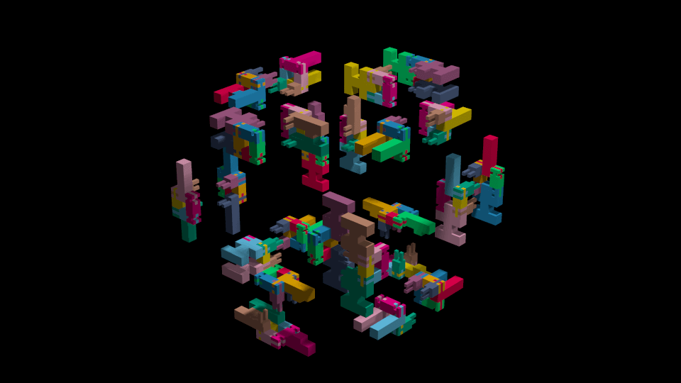

# Holey Cube puzzle animation

This repository contains the POV-Ray source files for creating an animation
featuring the Holey Cube puzzle. The Holey Cube puzzle is an extension of the
puzzle Twelve Straight/Twisted designed by Yukio Hirose.

## Puzzle Levels

The Holey Cube puzzle is created recursively, in a fractal-like manner. It
consists of the following levels:

- Level 1: The original Twelve Straight/Twisted puzzle, consisting of twelve
  distinct parts.

- Level 2 consists of twelve Level 2 parts. Each parts is assembled the same
  as in the Level 1 puzzle.

  Each Level 2 parts consists of Level 1 body. Four out its parts have a bulky
  appendix. These form the connectors of the Level 2 puzzle parts, enabling
  assembly into a Level 2 puzzle.

  There are twelve parts of each Level 1 puzzle part type, for a total of
  12 * 12 = 144 parts. The puzzle is designed such that the bulky appendixes
  are equally distributed across the part types.

- Level 3 consists of twelve Level 3 parts, which is each formed from a
  Level 2 puzzle. For each part there are an additional four parts, which
  can be attached to the Level 2 puzzle to create the connectors needed to
  assemble the parts into a Level 3 puzzle. So each Level 3 puzzle part
  consists of 144 + 4 = 148 puzzle parts, for a total of 1776 puzzle parts.

  The approach in this last level can be extended infinitely to create a
  puzzle an infinite number of holes comprised of an infinite number of parts.

## Scenes

The animation consists of the following scenes:

- Scene 1, 73s (0:00 - 1:13): Assembles the Level 1 puzzle.
  This is the original Twelve Straight/Twisted puzzle.

- Scene 2, 56s (1:14 - 2:09): Disassembles the Level 1 puzzle.

  The parts are returned to a bigger collection of parts, which together can be
  assembled into a Level 2 puzzle.

- Scene 3, 190s (2:10 - 5:19): Moves the Level 2 parts from their stacks to
  prepare for assembly.

  Each part is moved so that a position and orientation that matches where it
  needs to be placed in the assembled puzzle.

  A greedy scheduling algorithm is used with collision detection to maximise the
  number of parts that moves at any time without any parts colliding.

  Once a part is at its destination location, it also starts moving to the beat.

- Scene 4, 30s (5:20 - 5:49): Constructs the Level 2 parts.

- Scene 5, 42s (5:49 - 6:31): Assembles the Level 2 puzzle.

- Scene 6 [TBD]: Zooms out to show more Level 2 puzzles, positioned to form a
  Level 3 puzzle.